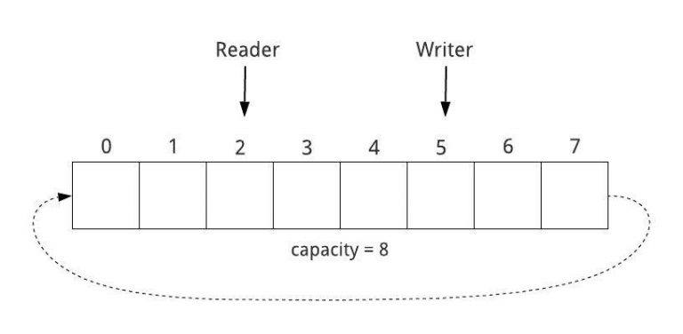

# The one and only test

Een soort van kladblok.

## Logic Nota

### Checksum

Om terug bij het eerste element van een array te raken => modulo

( 7 + 1 ) % 8 = 0 => array[0]

### Stream

KISS: Keep It Simple Stupid
Boomachtige structuur

### Seven Segmented Search

### Basiscase

We kunnen op basis van de gekende actieve segmenten een mapping opstellen:

` public dictonary MapBasicCase (segments){

        
        new dict mapping = new dict()

        if(segments.length = 2){

        }

}`

### Extension

Voor het vervorg geldt dit niet. De lengte van sommige segmenten is hetzelfde en werkt de logica niet van de basiscase. Er valt toch een patroon of een *fingerprint* te vinden,zo is er overlap tussen de verschillende cijfers. 

Zo vind je 0,6 of 9 door de overlap te vergelijken met andere cijfers.

if ( segmentFor4 ). ContainsCharsOf (getal9)
    map[segment] = 9

elseif ( segmentFor1 ). ContainsCharsOf (getal9)
    map[segment] = 0

else 
     map[segment6] = 6

    
Dit kan gelijkaardig voor de andere segmenten ook gedaan worden.

### Fractals

De klassieker om een recursief probleem toe te passen of een oneerbiedige refactored loop. De moeilijkheid aan deze oefening is dat er meerdere patronen mogelijk zijn bij het `groeien` van de fractalstructuur. Dit kan op minstens 2 manieren aangepakt worden: alle mogelijk input op voorhand alvast berekenen en de mogelijke uitkomsten op te zoeken of dit tijdens de uitvoering te doen. Er zullen enkele nog steeds enkele functies nodig zijn: om een matrix te transponeren en te roteren, de aantal `aan` vakjes te tellen, te checken of de matrix deelbaar is, deze terug op te delen en uiteindelijk nog een fucntie om de matrix te laten uitbreiden.

Een mogelijk control flow zou dan kunnen zijn:
- de regels uitbreiden door de inputs te transponeren en te roteren en hiervan een nieuwe txt te maken
- matrixformaat bepalen
- deze te splitsen
- de patronen zoeken in de nieuwe lijst en deze ophalen
- de matrix uitbreiden
- de teller met 1 verhogen

vanaf de gevraagde extensie is bereikt dit stoppen en de matrix overlopen en de `aan` vakjes tellen.

